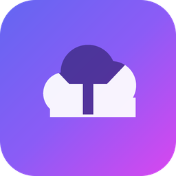
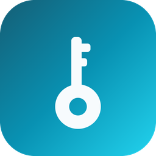
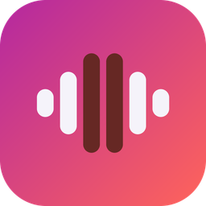
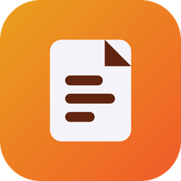
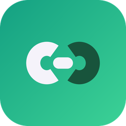
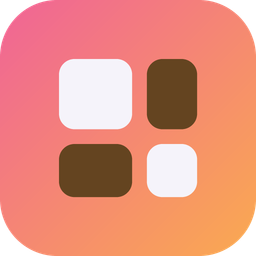
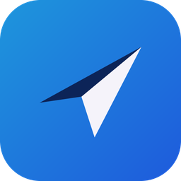
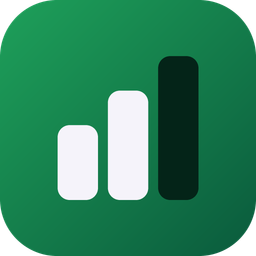
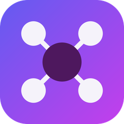

  

 

Un seul fichier de 7 Mo · installé en une quinzaine de secondes · gratuit, sans pub, sans pisteur

 

  

 

## La suite, au même endroit

CordLauncher, c'est la porte d'entrée de **la suite Cord** : des outils perso, indépendants, qui se branchent entre eux. Tu choisis ce qui te sert, il s'occupe du reste (installation, mises à jour, versions iPhone).

<table>
  <tr>
    <td align="center" width="11%"> <b>Drivecord</b> Stockage sans limite 🟢 Disponible</td>
    <td align="center" width="11%"> <b>Passcord</b> Mots de passe 🔵 Bêta iPhone</td>
    <td align="center" width="11%"> <b>Tunecord</b> Podcasts ⚪ Bientôt</td>
    <td align="center" width="11%"> <b>Notecord</b> Notes ⚪ Bientôt</td>
    <td align="center" width="11%"> <b>Linkcord</b> Page perso ⚪ Bientôt</td>
    <td align="center" width="11%"> <b>Bentocord</b> Profil bento ⚪ Bientôt</td>
    <td align="center" width="11%"> <b>Gocord</b> Go-links ⚪ Bientôt</td>
    <td align="center" width="11%"> <b>Quizcord</b> Blind-tests ⚪ Bientôt</td>
    <td align="center" width="11%"> <b>Budgetcord</b> Budget perso ⚪ Bientôt</td>
  </tr>
</table>

Les nouvelles apps apparaissent dans CordLauncher dès leur sortie, sans rien réinstaller.

## Ce que fait CordLauncher

<table>
  <tr>
    <td width="50%" valign="top">
      <h3>⚡ Installe en un clic</h3>
      Un bouton, et l'app est là, avec son raccourci. Pas de droits administrateur, pas d'assistant à rallonge, dans le dossier de ton choix. Chaque installateur est vérifié (empreinte SHA-256) avant d'être lancé.
    </td>
    <td width="50%" valign="top">
      <h3>🔄 Tout reste à jour</h3>
      Les nouvelles versions arrivent toutes seules : CordLauncher te prévient ou les installe sans rien demander, selon ton choix. Il se met aussi à jour lui-même.
    </td>
  </tr>
  <tr>
    <td width="50%" valign="top">
      <h3>📱 Tes apps iPhone, depuis le PC</h3>
      Il installe les versions iPhone de la suite avec ton compte Apple, puis les <b>renouvelle avant qu'elles expirent</b> (7 jours avec un compte gratuit). Par câble ou <b>en Wi-Fi</b>, et il te prévient la veille si ton iPhone n'est pas là.
    </td>
    <td width="50%" valign="top">
      <h3>🪪 Un seul compte pour tout</h3>
      Ton <a href="https://compte.cordsuite.app">Compte Cord</a> t'ouvre toute la suite. Connexion express, ou sans mot de passe avec <b>Passcord</b> : la demande arrive sur ton iPhone, tu choisis le bon nombre, Face ID, c'est ouvert.
    </td>
  </tr>
  <tr>
    <td width="50%" valign="top">
      <h3>🔔 Il te tient au courant</h3>
      Nouvelle version, app qui expire bientôt, iPhone mis à jour : une notification Windows, et une sur ton iPhone si tu as installé l'app Compte Cord sur l'écran d'accueil.
    </td>
    <td width="50%" valign="top">
      <h3>🎨 Joli, et léger</h3>
      Verre dépoli, animations douces, thème clair ou sombre, et une option pour réduire la transparence et les animations sur les petites machines.
    </td>
  </tr>
</table>

## En trois étapes

| | |
|:---:|---|
| **1** | **Télécharge** [`CordLauncher-Setup.exe`](https://github.com/LeVraiLunatix/cordlauncher-releases/releases/latest/download/CordLauncher-Setup.exe) et ouvre-le. |
| **2** | **Clique sur Installer.** C'est tout : une quinzaine de secondes, sans droits administrateur. Les options (dossier, raccourci) sont là si tu en as besoin. |
| **3** | **Laisse-toi accueillir.** Au premier lancement, CordLauncher te demande ton Compte Cord (ou t'en crée un), le dossier de tes apps et, si tu veux, ton iPhone. Rien n'est obligatoire. |

> [!NOTE]
> **« Windows a protégé votre ordinateur » ?** CordLauncher est une bêta qui n'est pas encore signée numériquement, alors SmartScreen se méfie par défaut. Clique sur **Informations complémentaires**, puis **Exécuter quand même**. Tu peux vérifier que le fichier est bien l'original avec l'empreinte SHA-256 indiquée sur la page de chaque version.

## Pour ton iPhone

<b>Comment ça marche ?</b>

 

Apple n'autorise l'installation d'apps hors App Store qu'avec un compte Apple qui les signe. CordLauncher fait ça pour toi, depuis ton PC :

1. Tu ajoutes ton compte Apple (un compte gratuit suffit). Il reste sur ce PC, dans le coffre de Windows, jamais envoyé ailleurs qu'à Apple.
2. Tu branches ton iPhone et tu touches **« Se fier à cet ordinateur »**.
3. Tu choisis l'app : CordLauncher la télécharge, la signe et l'installe.

Avec un compte gratuit, une app reste valable **7 jours**. CordLauncher la renouvelle tout seul quand il reste 2 jours ou moins, dès que ton iPhone est branché ou sur le même Wi-Fi.

<b>Et sans câble ?</b>

 

Dans l'onglet **iPhone**, active **« Wi-Fi »** une fois l'iPhone branché. Ensuite, tant que l'iPhone est **déverrouillé** et sur le **même réseau** que le PC, CordLauncher le trouve tout seul.

S'il reste « hors de portée » : sur l'iPhone, **Réglages › Wi-Fi › ⓘ** à côté du réseau, puis **Adresse Wi-Fi privée › Désactivée**.

<b>Il me faut iTunes ?</b>

 

Il faut le service qui fait parler Windows avec l'iPhone : installe **iTunes** ou l'app **Appareils Apple** depuis le Microsoft Store. CordLauncher te le dit s'il manque.

## Questions fréquentes

<b>C'est gratuit ?</b>

 
Oui. CordLauncher et le Compte Cord sont gratuits, sans pub et sans pisteur.

<b>Qu'est-ce qu'il sait de moi ?</b>

 
Rien de plus que ce qu'il faut. Ta session Cord et ton mot de passe Apple sont gardés dans le coffre de Windows. Le Compte Cord ne stocke que ton profil et de quoi sécuriser ton compte, et tu peux tout exporter ou tout supprimer depuis <a href="https://compte.cordsuite.app">compte.cordsuite.app</a>.

<b>Comment le désinstaller ?</b>

 
Comme n'importe quelle app : <b>Paramètres Windows › Applications › CordLauncher › Désinstaller</b>. Les apps de la suite que tu as installées restent en place.

<b>Je le mets à jour comment ?</b>

 
Il le fait lui-même : <b>Réglages › Rechercher une mise à jour</b>. Tu peux aussi relancer le dernier installateur par-dessus : tes réglages et ton compte sont conservés.

## Configuration requise

| | |
|---|---|
| **Système** | Windows 10 ou 11, 64 bits |
| **Droits** | Aucun droit administrateur |
| **Espace** | Environ 20 Mo pour CordLauncher (plus tes apps) |
| **iPhone** *(facultatif)* | Un câble pour la première fois · iTunes ou Appareils Apple sur le PC · un compte Apple (gratuit) |

## Versions

Toutes les versions, avec leurs notes et leurs empreintes, sont dans les **[Releases](https://github.com/LeVraiLunatix/cordlauncher-releases/releases)**. Le lien de téléchargement en haut de cette page pointe toujours vers la dernière.

 

**Une idée, un bug, une question ?** Viens en parler sur le **[Discord de la suite](https://discord.gg/EyX2YR6nAy)**.

 

<a href="https://www.cordsuite.app">cordsuite.app</a> · <a href="https://compte.cordsuite.app">Compte Cord</a> · <a href="https://discord.gg/EyX2YR6nAy">Discord</a>

© 2026 Lunatix · CordLauncher est un logiciel libre sous licence <a href="LICENSE">AGPL-3.0</a> · noms et logos réservés (<a href="NOTICE.md">NOTICE</a>)

